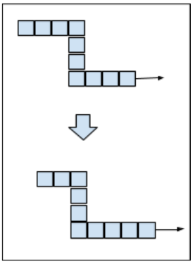
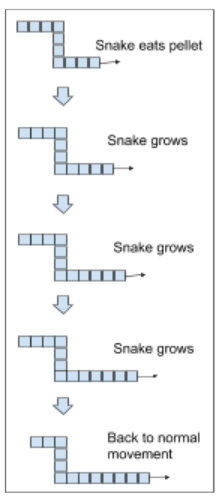

## Embedded Snake

Your task is to create an embedded version of the game “snake.”  You have an 8-bit, 256x256 pixel screen and four GPIOs to represent the up, down, left, and right buttons.  The rules of the game are as follows:

- Your snake must start out two pixels in length and start at a random position on the screen in a random initial direction.
- On each tick of the game clock the snake’s head will move one pixel in the current direction.  The whole body will also shift one pixel, except after eating a “pellet” when the snake’s body will grow as defined below.  Here is an example of a normal movement:



- You cannot spawn the snake in an “invalid” location (for example right next to the wall, pointing towards the wall).
- You must always have a single “pellet” (one pixel in size) spawned in a random location on the screen.  The pellet cannot be spawned on top of the snake's body.
- When the snake “eats” the pellet by intersecting it’s head pixel the snake’s tail will grow by three pixel in length and a new random “pellet” will be spawned.  Here is an example of it growing:



- When the snake’s head intersects any pixel in its body or goes off of the screen then the game is over.  You must clear the screen and display the text “Game over” until any button is pressed to reset the game.
- When the user presses a button, the snake’s head should change direction corresponding to the button pressed during the next movement.

You have the following API provided by the system:

```
enum gpio_t {
  kGpioUp = 0,
  kGpioDown = 1,
  kGpioLeft = 2,
  kGpioRight = 3
}

/**
This function will sample the current instantaneous state of the GPIO pin when called.  It will return true if the button is pressed, and false otherwise.  This function takes 10 microseconds to complete.  Note that this switch is implemented as a raw push-button with no hardware filtering.
*/
bool GetGpio(gpio_t direction);

/**
This function will take a pointer to a 65536 byte array which will update the state of the screen based on the values in the array.  Each pixel can take a grey-scale value of 0 (white) to 255 (black).  This function takes 10 milliseconds to complete.
*/
void UpdateScreen(unsigned char *screen_buffer);

/**
This function will give you the current system time in 1 microsecond ticks.  Ints are 32-bits on this system.
*/
unsigned int GetTicks();

```

Your implementation must meet the following constraints:
- Implemented in valid C++ that conforms to C++17 or earlier (i.e. if given stubs for the API provided it will compile and run).
- No use of any dynamic memory allocations.
- No use of third party libraries, although you may use C++ standard library/STL as long as you don’t use any structures or functions that do dynamic memory allocation.
- Must provide a unit test with mocks for the system API that exercises the functionality specified in the functional specification.  You are free to use third party libraries (like gtest) for the test harnessing.
- Must be able to build using cmake, or preferably bazel.

